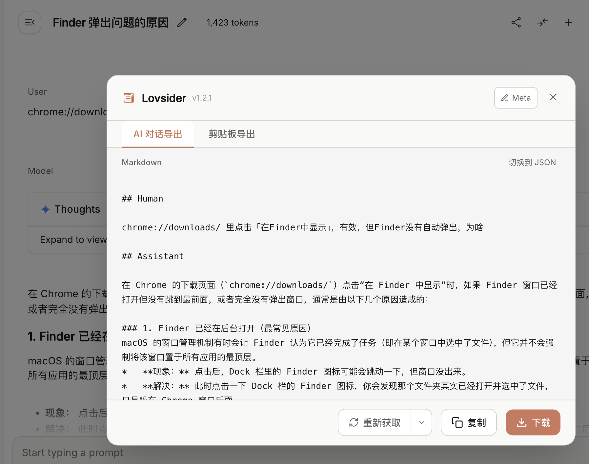

<p align="center">
  
</p>

<h1 align="center">
  
  LovSider
</h1>

<p align="center">
  <strong>AI Chat Export & Web Content Capture</strong><br>
  <sub>Chrome Extension · Firefox Add-on</sub>
</p>

<p align="center">
  
  
  
  
</p>

---

## Core Features

### 1. AI Chat Export

Export conversations from **Claude.ai** and **Google AI Studio** with full fidelity.

<p align="center">
  
</p>

**How to use:**
- Click floating badge on AI chat pages, or
- Press `Cmd+E` (Mac) / `Ctrl+E` (Windows)

**Features:**
- **API-based** - Fetches complete conversation via backend API, not DOM scraping
- **Thinking Process** - Toggle to include/exclude AI's thinking blocks
- **Multiple Formats** - Export as Markdown or JSON
- **Quick Actions** - Copy to clipboard or download as file

| Platform | Export | Thinking Support |
|----------|--------|------------------|
| Claude.ai | ✅ | ✅ |
| Google AI Studio | ✅ | ✅ |

### 2. Web Content Capture

Capture any web page content and export as Markdown via sidebar.

**How to use:**
- Press `Cmd+Shift+S` to open sidebar
- Select content area

**Features:**
- **Smart Selection** - Auto-detect main content areas
- **Manual Selection** - Click to select any DOM element
- **Markdown Export** - Convert HTML to clean Markdown

---

## Keyboard Shortcuts

| Shortcut | Action |
|----------|--------|
| `Cmd+E` | Open AI chat export dialog |
| `Cmd+Shift+S` | Toggle sidebar |
| `Escape` | Exit selection mode |

## Installation

### From Release

Download the latest `.zip` from [Releases](https://github.com/MarkShawn2020/lovsider/releases), unzip and load in browser.

### From Source

```bash
git clone https://github.com/MarkShawn2020/lovsider.git
cd lovsider
pnpm install
pnpm build
```

**Chrome:** `chrome://extensions` → Enable Developer mode → Load unpacked → Select `dist`

**Firefox:** `about:debugging` → Load Temporary Add-on → Select `dist/manifest.json`

## Tech Stack

- React 19 + TypeScript
- Vite + Turborepo
- Tailwind CSS + shadcn/ui
- Chrome Extension Manifest V3

## License

[MIT](LICENSE)
